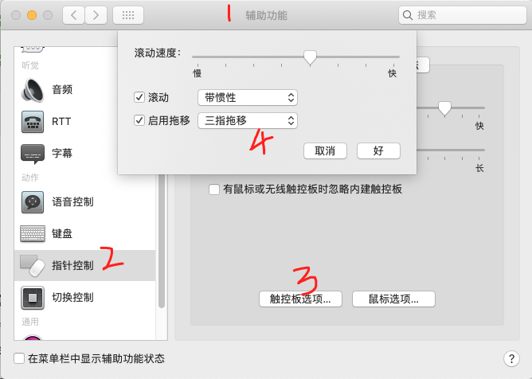
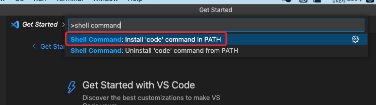
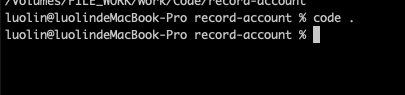
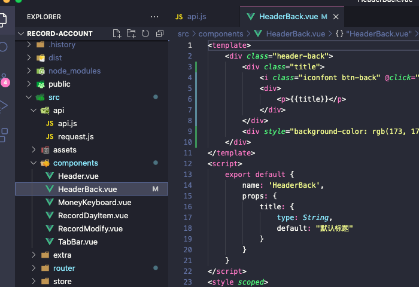

<div style="width: 100%; text-align: center; font-size: 2rem; font-weight: 900"><font>Mac 系统使用手册</font></div>


> 文档说明：该文档，将作为rollin个人使用Mac的一些操作习惯，以及一些常用的App操作。
>
> 创建时间：2021-10-05 18:33:19
>

[TOC]

## Mac 触摸板操作

### 触摸板常见设置


### 三指拖动窗口设置



## Mac 常用的操作

### Mac 去掉自动生成 “.DS_Store” 文件

#### 概述

DS_Store 是给Finder用来存储这个文件夹的显示属性的：比如文件图标的摆放位置。删除以后的副作用就是这些信息的失去。（当然，这点副作用其实不是太大。

#### 操作步骤

##### 删除指定文件夹下的 “.DS_Store”

```java
sudo find /Volumes/FILE_WORK/work/Code/SpringBoot/life-code -name ".DS_Store" -depth -exec rm {} \;
```

注意：/Volumes/FILE_WORK/work/Code/SpringBoot/life-code 为指定的目录。

##### 设置不再产生 “.DS_Store”

```java
defaults write com.apple.desktopservices DSDontWriteNetworkStores true 
```

### 显示/隐藏  “.” 开头的文件

```javascript
$ defaults write com.apple.Finder AppleShowAllFiles YES  # YES表示显示文件， NO 表示隐藏文件
$ killall Finder
```


## Mac 常用的命令操作

## Mac 软件常用的操作

### Mac 环境变量配置

#### 设置 .zshrc

说明：每次打开终端都需要执行命令 source ~/.bash_profile，解决办法。

##### 打开.zshrc

```java
$ vi ~/.zshrc
```

##### 添加 source ~/.bash_profile 退出保存

```
source ~/.bash_profile
```

##### 执行命令

```
source ~/.zshrc
```


### Mac 常用的别名配置

#### ll 别名配置

```json
alias ll='ls -alF'
```


### VSCode 设置

#### 使用" code . "打开项目

在VSCode 面板 输入快捷键（Shif + Command + P） 且 输入 “shell command”安装即可




在终端输入命令，"$ code . " 即可打开当前项目



### 常用插件

#### 文件导航图标( vscode-icons )


#### VSCode 使用Eclipse 快捷键( Eclipse Keymap )


#### 喜欢的主题( Dracula Official )




#### Vue项目的工具包（ Vetur ）


