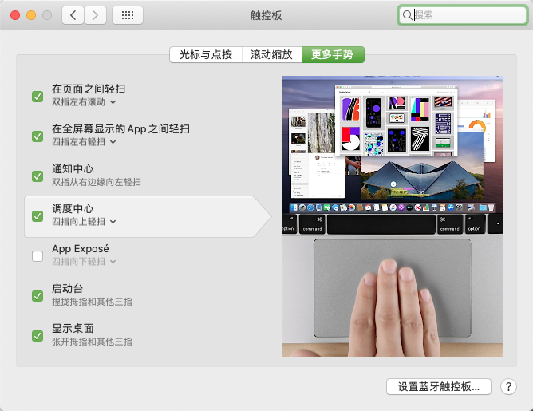

<div style="width: 100%; text-align: center; font-size: 2rem; font-weight: 900"><font>Mac 系统使用手册</font></div>


> 文档说明：该文档，将作为rollin个人使用Mac的一些操作习惯，以及一些常用的App操作。
>
> 创建时间：2021-10-05 18:33:19
>

### Mac 触摸板操作

#### 触摸板常见设置




#### 三指拖动窗口设置


### Mac 去掉自动生成 “.DS_Store” 文件

#### 概述

DS_Store 是给Finder用来存储这个文件夹的显示属性的：比如文件图标的摆放位置。删除以后的副作用就是这些信息的失去。（当然，这点副作用其实不是太大。

#### 操作步骤

##### 删除指定文件夹下的 “.DS_Store”

```java
sudo find /Volumes/FILE_WORK/work/Code/SpringBoot/life-code -name ".DS_Store" -depth -exec rm {} \;
```

注意：/Volumes/FILE_WORK/work/Code/SpringBoot/life-code 为指定的目录。

##### 设置不再产生 “.DS_Store”

```java
defaults write com.apple.desktopservices DSDontWriteNetworkStores true 
```

### 显示/隐藏  “.” 开头的文件

```javascript
$ defaults write com.apple.Finder AppleShowAllFiles YES  # YES表示显示文件， NO 表示隐藏文件
$ killall Finder
```

