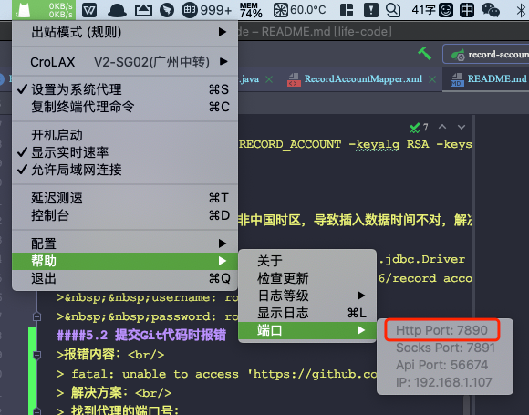
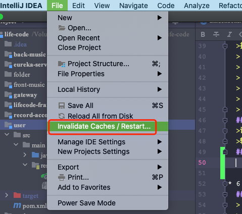
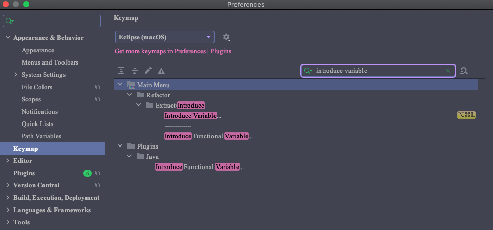

### 创建时间：2021-01-07 14:42:17

> 集成音乐后台 2021-01-11 13:51:10

### 1.框架说明

> 1.maven-client -->  公共依赖配置pox( 添加 jar包 依赖) <br><br>
&nbsp;&nbsp;&nbsp;&nbsp; _org.springframework.cloud - **spring-cloud-dependencies**_ <br>
&nbsp;&nbsp;&nbsp;&nbsp; _org.springframework.boot - spring-boot-starter-web_ <br>
&nbsp;&nbsp;&nbsp;&nbsp; _org.springframework.boot - spring-boot-starter-test_ <br>
&nbsp;&nbsp;&nbsp;&nbsp; _org.projectlombok - lombok_ <br>
&nbsp;&nbsp;&nbsp;&nbsp; _com.alibaba - fastjson_ <br>
> 
> 2.maven-web --> web依赖（例如：）
> 
> 3.framework-core --> 公共类 

### 2.插件说明

> 1.plantuml (画图软件)<br/>
> &nbsp;&nbsp;&nbsp;&nbsp;指导文件：http://plantuml.com/zh/guide <br/>
> 2.Lombok <br/>
> > 1.@Data = getter/setter + toString() + equals() + hashCode() <br/>
> > 2.@AllArgsConstructor(access = AccessLevel.PRIVATE)、@NoArgsConstructor <br/>
> > 3.@Slf4j (打日志时尽量别用字符串拼接，不够直观且效率低，应该使用{}占位符，用逗号隔开) <br/>
> > &nbsp;&nbsp;&nbsp;&nbsp;log.info("请求数据：\r\n{}", FormatUtil.formatJson(sessionStream));

### 3.证书相关

#### 4.1 加密策略
> 1.随机生成AES密钥key -- aesKey </br>
> 2.AES加密明文 -- AES (message) = byte[] </br>
> 3.RSA公钥加密aesKey -- RSA (aesKey) = byte[] </br>
> 4.拼接：RSA(aesKey) + AES(message) = byte[] </br>
#### 4.2 生成证书命令
> keytool -genkey -alias RECORD_ACCOUNT -keyalg RSA -keystore record_account.jks -keysize 2048 -sigalg sha256withrsa -validity 36500 -storepass ra123456 -keypass ra123456 -dname "CN=RECORD_ACCOUNT,OU=LifeCode,O=LifeCode,L=GuangDong,ST=ShenZhen,C=ZH"

### 5 项目中遇到的问题

#### 5.1 请求时间问题
> 未指定时区时，默认指定时区非中国时区，导致插入数据时间不对，解决方案，在配置mysql url 地方添加：serverTimezone=Asia/Shanghai <br/>
> datasource: <br/>
>&nbsp;&nbsp;driver-class-name: com.mysql.cj.jdbc.Driver #mysql驱动 <br/>
>&nbsp;&nbsp;url: jdbc:mysql://localhost:3306/record_account?zeroDateTimeBehavior=convertToNull&tinyInt1isBit=false&characterEncoding=UTF-8&useSSL=false&serverTimezone=Asia/Shanghai <br/>
>&nbsp;&nbsp;username: root <br/>
>&nbsp;&nbsp;password: root123456 <br/>
#### 5.2 提交Git代码时报错
>报错内容：<br/>
> fatal: unable to access 'https://github.com/luolin2611/life-code/': LibreSSL SSL_connect: SSL_ERROR_SYSCALL in connection to github.com:443<br/>
> 解决方案：<br/>
> 找到代理的端口号：
> <br/>
> 执行命令：
> git config --global --add remote.origin.proxy "127.0.0.1:7890"
#### 5.3 本地打包正常，服务器乱码
>说明：注意你的服务器编码方式，linux系统的服务器编码默认是utf-8，对于是windows的服务器默认不是utf-8。所以在启动的时候需要设置编码方式。<br/>
>输入命令：$ java -Dfile.encoding=utf-8 -jar xxx.jar
#### 5.4 idea 有时提示找不到类或者符号的解决
>解决方案：清楚缓存即可
> 

### 6.其它

#### 6.1 生成banner
> 地址： https://www.bootschool.net/ascii
> 选项:  3d-ascii
#### 6.2 打包相关
> mvn clean package -P sit1
#### 6.3 soar举例
```
  if (dayRecordAccountObjectList.size() <= 0) {
    return list;
  }

  Collection.isEmpty() should be used to test for emptiness
  
  if (dayRecordAccountObjectList.isEmpty()) {
    return list;
  }
```
#### 6.4 jdk 1.8 新增 Java Lambda 表达式 （List 可以使用 stream()、filter 对内容进行操作）
```
  Double sum = obj.getDayRecordAccountObjects().stream().filter(dayRecordAccountObjectFilter -> "0".equals(dayRecordAccountObjectFilter.getClassifyType())).collect(Collectors.summingDouble(DayRecordAccountObject::getBillMoney));
```
#### 6.5 遍历list之后将list中对象根据某个元素重新组合
```
  参考BillServiceImpl.class --> processDayRecordAccountList()
```
#### 6.6 遍历List时，使用 i < list.size() 这样会增加每次每次都去计算list.size() 解决方案如下。
```
for (int i = 0, size = dayRecordAccountObjectList.size(); i < size; i++) {

}
```

#### 6.7 使用StringUtils 以及 CollectionUtils

##### 6.7.1 分别导入maven依赖

```xml
<dependency>
    <groupId>org.apache.commons</groupId>
    <artifactId>commons-lang3</artifactId>
    <version>3.12.0</version>
</dependency>

<dependency>
    <groupId>commons-collections</groupId>
    <artifactId>commons-collections</artifactId>
    <version>3.2.2</version>
</dependency>
```

##### 6.7.2 常用语法

###### 1.StringUtils.isEmpty();

###### 2.CollectionUtils.isEmpty();

### 7.开发工具的使用

#### 1.Idea 快捷键

以下文章是根据Idea使用Elipse(macOS)的模式配置。

##### 1.1 自动生成变量名快捷键

​	在IDEA界面依次点击File- ->Settings- ->Keymap,在输入框中输入introduce variable



### 8.Mac操作习惯

#### 1.触摸板常见设置


