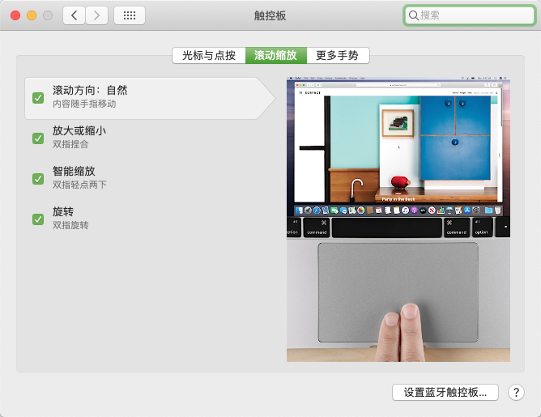

<div style="width: 100%; text-align: center; font-size: 2rem; font-weight: 900"><font>代码人生ReadMe</font></div>


> 文档说明：该文档，将作为rollin个人经验技术成长文档，同时也作为个人项目配置指引文档
>
> 创建时间：2021-01-07 14:42:17
>
> 集成音乐后台 2021-01-11 13:51:10

### 1.框架说明

> 1.maven-client -->  公共依赖配置pox( 添加 jar包 依赖) <br><br>
&nbsp;&nbsp;&nbsp;&nbsp; _org.springframework.cloud - **spring-cloud-dependencies**_ <br>
&nbsp;&nbsp;&nbsp;&nbsp; _org.springframework.boot - spring-boot-starter-web_ <br>
&nbsp;&nbsp;&nbsp;&nbsp; _org.springframework.boot - spring-boot-starter-test_ <br>
&nbsp;&nbsp;&nbsp;&nbsp; _org.projectlombok - lombok_ <br>
&nbsp;&nbsp;&nbsp;&nbsp; _com.alibaba - fastjson_ <br>
> 
> 2.maven-web --> web依赖（例如：）
> 
> 3.framework-core --> 公共类 


### 2.插件说明

#### 1.plantuml (画图软件)

&nbsp;&nbsp;&nbsp;&nbsp;指导文件：http://plantuml.com/zh/guide 

#### 2.Lombok 

1.@Data = getter/setter + toString() + equals() + hashCode() 
2.@AllArgsConstructor(access = AccessLevel.PRIVATE)、@NoArgsConstructor
3.@Slf4j (打日志时尽量别用字符串拼接，不够直观且效率低，应该使用{}占位符，用逗号隔开) 

```js
log.info("请求数据：\r\n{}", FormatUtil.formatJson(sessionStream));
```

### 3.证书相关

#### 1.加密策略（RSA）
1.随机生成AES密钥key -- aesKey
2.AES加密明文 -- AES (message) = byte[]
3.RSA公钥加密aesKey -- RSA (aesKey) = byte[]
4.拼接：RSA(aesKey) + AES(message) = byte[] 

#### 2.生成证书命令

```js
keytool -genkey -alias RECORD_ACCOUNT -keyalg RSA -keystore record_account.jks -keysize 2048 -sigalg sha256withrsa -validity 36500 -storepass ra123456 -keypass ra123456 -dname "CN=RECORD_ACCOUNT,OU=LifeCode,O=LifeCode,L=GuangDong,ST=ShenZhen,C=ZH"
```

### 4 问题集锦

#### 1.请求时间问题

​	未指定时区时，默认指定时区非中国时区，导致插入数据时间不对，解决方案，在配置mysql url 地方添加：serverTimezone=Asia/Shanghai

```yaml
datasource:
	driver-class-name: com.mysql.cj.jdbc.Driver #mysql驱动
	url: jdbc:mysql://localhost:3306/record_account?zeroDateTimeBehavior=convertToNull&tinyInt1isBit=false&characterEncoding=UTF-8&useSSL=false&serverTimezone=Asia/Shanghai
	username: root
	password: root123456
```


#### 2.提交Git代码时报错
##### 报错内容：

```js
fatal: unable to access 'https://github.com/luolin2611/life-code/': LibreSSL SSL_connect: SSL_ERROR_SYSCALL in connection to github.com:443
```
##### 解决方案：

1. 找到代理的端口号：
   
   
   
2. 执行命令：

   ```
   git config --global --add remote.origin.proxy "127.0.0.1:7890"
   ```

#### 3.本地打包正常，服务器乱码
>说明：注意你的服务器x编码方式，linux系统的服务器编码默认是utf-8，对于是windows的服务器默认不是utf-8。所以在启动的时候需要设置编码方式。<br/>
>输入命令：$ java -Dfile.encoding=utf-8 -jar xxx.jar
#### 4.idea 有时提示找不到类或者符号的解决
>解决方案：清除缓存即可
> 


### 5.其它

#### 1.生成banner
> 地址： https://www.bootschool.net/ascii
> 选项:  3d-ascii
#### 2.打包相关
> mvn clean package -P sit1
#### 3.soar举例
```java
  if (dayRecordAccountObjectList.size() <= 0) {
    return list;
  }

  Collection.isEmpty() should be used to test for emptiness
  
  if (dayRecordAccountObjectList.isEmpty()) {
    return list;
  }
```
#### 4.jdk 1.8 新增 Java Lambda 表达式 （List 可以使用 stream()、filter 对内容进行操作）
```
  Double sum = obj.getDayRecordAccountObjects().stream().filter(dayRecordAccountObjectFilter -> "0".equals(dayRecordAccountObjectFilter.getClassifyType())).collect(Collectors.summingDouble(DayRecordAccountObject::getBillMoney));
```
#### 5.遍历list之后将list中对象根据某个元素重新组合
```
  参考BillServiceImpl.class --> processDayRecordAccountList()
```
#### 6.遍历List时，使用 i < list.size() 这样会增加每次每次都去计算list.size() 解决方案如下。
```
for (int i = 0, size = dayRecordAccountObjectList.size(); i < size; i++) {

}
```

#### 7.使用StringUtils 以及 CollectionUtils

##### 1.分别导入maven依赖

```xml
<dependency>
    <groupId>org.apache.commons</groupId>
    <artifactId>commons-lang3</artifactId>
    <version>3.12.0</version>
</dependency>

<dependency>
    <groupId>commons-collections</groupId>
    <artifactId>commons-collections</artifactId>
    <version>3.2.2</version>
</dependency>
```

##### 2.常用语法

###### 1.StringUtils

```java
// StringUtils.isBlank(null)      = true
// StringUtils.isBlank("")        = true
// StringUtils.isBlank(" ")       = false
// StringUtils.isBlank("bob")     = false
// StringUtils.isBlank("  bob  ") = false
StringUtils.isEmpty(final CharSequence cs);

// StringUtils.isBlank(null)      = true
// StringUtils.isBlank("")        = true
// StringUtils.isBlank(" ")       = true
// StringUtils.isBlank("bob")     = false
// StringUtils.isBlank("  bob  ") = false
StringUtils.isBlank(final CharSequence cs);

// 查看多个字符串中是否有空串 ==> 直接检查 （“”， null）
StringUtils.isNoneEmpty(final CharSequence... css);

// 查看多个字符串中是否有空串 ==> 只检查 （“”， “  ”， null）
StringUtils.isNoneBlank(final CharSequence... css);
```

###### 2.CollectionUtils

```
CollectionUtils.isEmpty();
CollectionUtils.isNotEmpty();
```

### 6.SQL 技术沉淀

#### 1.使用分组group by (有‘每’字就可以考虑分组)

##### 1.1 例如：查询某年每月的数据

```sql
SELECT SUM(bill_money) , MONTH(update_time) FROM record_account WHERE classify_type = '0' AND YEAR(update_time) = '2021' GROUP BY MONTH(update_time) ORDER BY MONTH(update_time) DESC
```

##### 1.2 sql 执行书序：温(when)哥(group by)华(having)白(group by)领(limit)


### 7.开发工具的使用

#### 1.Idea 快捷键

以下文章是根据Idea使用Elipse(macOS)的模式配置。

##### 1.1 自动生成变量名快捷键

​	在IDEA界面依次点击File- ->Settings- ->Keymap,在输入框中输入introduce variable


### 8.Mac操作习惯

#### 1.触摸板常见设置





### 类、接口和类图

#### 1.类
类（Class）是指具有相同属性、方法和关系的对象的抽象，它封装了数据和行为，是面向对象程序设计（OOP）的基础，具有封装性、继承性和多态性等三大特性。在 UML 中，类使用包含类名、属性和操作且带有分隔线的矩形来表示。

##### (1) 类名（Name）是一个字符串，例如，Student。

##### (2) 属性（Attribute）是指类的特性，即类的成员变量。UML 按以下格式表示：

```
[可见性]属性名:类型[=默认值]
```

例如：-name:String

注意：“可见性”表示该属性对类外的元素是否可见，包括公有（Public）、私有（Private）、受保护

（Protected）和朋友（Friendly）4 种，在类图中分别用符号+、-、#、~表示。

##### (3) 操作（Operations）是类的任意一个实例对象都可以使用的行为，是类的成员方法。UML 按以下格式表示：

```
[可见性]名称(参数列表)[:返回类型]
```

例如：+display():void。 


<div style="width: 100%; text-align: center; font-size: 1rem">学生类的UML 类图<font></font></div>

#### 2.接口

接口（Interface）是一种特殊的类，它具有类的结构但不可被实例化，只可以被子类实现。它包含抽象操作，但不包含属性。它描述了类或组件对外可见的动作。在 UML 中，接口使用一个带有名称的

小圆圈来进行表示。


#### 3.类图

**类图（ClassDiagram）是用来显示系统中的类、接口、协作以及它们之间的静态结构和关系的一种静态模型**。它主要用于描述软件系统的结构化设计，帮助人们简化对软件系统的理解，它是系统分

析与设计阶段的重要产物，也是系统编码与测试的重要模型依据。

类图中的类可以通过某种编程 语言直接实现。类图在软件系统开发的整个生命周期都是有效的，它是面向对象系统的建模中最常见的图。

如下图所示是“计算长方形和圆形的周长与面积”的类图，图形接口有计算面积和周长的抽象方法，长方形和圆形实现这两个方法供访问类调用。


<div style="width: 100%; text-align: center; font-size: 1rem">“计算长方形和圆形的周长与面积”的类图<font></font></div>

### 类之间的关系

在软件系统中，类不是孤立存在的，类与类之间存在各种关系。

根据类与类之间的耦合度从弱到强排列，UML 中的类图有以下几种关系：依赖关系、关联关系、聚合关系、组合关系、泛化关系和实现关系。其中泛化和实现的耦合度相等，它们是最强的。

#### 1.依赖关系

依赖（Dependency）关系是一种使用关系，它是对象之间耦合度最弱的一种关联方式，是临时性的关联。在代码中，某个类的方法通过局部变量、方法的参数或者对静态方法的调用来访问另一个类（被依赖类）中的某些方法来完成一些职责。

在 UML 类图中，依赖关系使用带箭头的虚线来表示，箭头从使用类指向被依赖的类。如图所示是人与手机的关系图，人通过手机的语音传送方法打电话。


#### 2.关联关系

关联（Association）关系是对象之间的一种引用关系，用于表示一类对象与另一类对象之间的联系，如老师和学生、师傅和徒弟、丈夫和妻子等。**关联关系是类与类之间最常用的一种关系，分为一般关联关系、聚合关系和组合关系。**我们先介绍一般关联。

**关联可以是双向的，也可以是单向的。在 UML 类图中，双向的关联可以用带两个箭头或者没有箭头的实线来表示，单向的关联用带一个箭头的实线来表示，箭头从使用类指向被关联的类。也可以在关联线的两端标注角色名，代表两种不同的角色。**

**在代码中通常将一个类的对象作为另一个类的成员变量来实现关联关系。**

如图所示是老师和学生的关系图，每个老师可以教多个学生，每个学生也可向多个老师学，他们是双向关联。


#### 3.聚合关系

**聚合（ Aggregation ）关系是关联关系的一种，是强关联关系，是整体和部分之间的关系，是 has-a 的关系。**

聚合关系也是通过成员对象来实现的，其中成员对象是整体对象的一部分，但是成员对象可以脱离整体

对象而独立存在。例如，学校与老师的关系，学校包含老师，但如果学校停办了，老师依然存在。

**在 UML 类图中，聚合关系可以用带空心菱形的实线来表示，菱形指向整体。**

如图所示是大学和教师的关系图。


#### 4.组合关系

**组合（Composition）关系也是关联关系的一种，也表示类之间的整体与部分的关系，但它是一种更强烈的聚合关系，是contains-a关系。**

在组合关系中，整体对象可以控制部分对象的生命周期，一旦整体对象不存在，部分对象也将不存在，

部分对象不能脱离整体对象而存在。例如，头和嘴的关系，没有了头，嘴也就不存在了。

在 UML 类图中，组合关系用带实心菱形的实线来表示，菱形指向整体。如图所示是头和嘴的关系图。


#### 5.泛化关系

**泛化（Generalization）关系是对象之间耦合度最大的一种关系，表示一般与特殊的关系，是父类与子类之间的关系，是一种继承关系，是** **is-a** **的关系。**

**在 UML 类图中，泛化关系用带空心三角箭头的实线来表示，箭头从子类指向父类。**在代码实现时，使用面向对象的继承机制来实现泛化关系。例如，Student 类和 Teacher 类都是 

Person 类的子类，其类图如图所示。


#### 6.实现关系

**实现（Realization）关系是接口与实现类之间的关系。在这种关系中，类实现了接口，类中的操作实现了接口中所声明的所有的抽象操作。**

**在** **UML** **类图中，实现关系使用带空心三角箭头的虚线来表示，箭头从实现类指向接口。**例如，汽车和船实现了交通工具，其类图如图所示。


### 面向对象设计原则

#### 概述

##### 参考链接

> https://www.bilibili.com/video/BV1E7411A7mk?from=search&seid=1244811038631909112&spm_id_from=333.337.0.0

##### 软件的可维护性和可复用性

知名软件大师Robert C.Martin认为一个可维护性(Maintainability)较低的软件设计，通常由于如下4个原因造成:

* 过于僵化(Rigidity):设计难以修改
* 过于脆弱(Fragility): 设计易遭到破坏

* 牢固性(Immobility):复用率低

* 黏度过高(Viscosity):难以做正确事情

##### 软件的可维护性和可复用性

软件工程和建模大师PeterCoad认为，一个好的系统设计应该具备如下三个性质:

* 可扩展性(Extensibility)
* 灵活性(Flexibility)
* 可插入性(Pluggability)

##### 软件的可维护性和可复用性

* <font style="color: red;">软件的复用</font>(Reuse)或重用拥有众多优点，如可以提高软件的开发效率，提高软件质量，节约开发成本，<font style="color: red;">恰当的复用还可以改善系统的可维护性</font>。
* 面向对象设计复用的目标在于<font style="color: red;">实现支持可维护性的复用。</font>
* 在面向对象的设计里面，<font style="color: red;">可维护性复用都是以面向对象设计原则为基础的</font>，这些设计原则首先都是复用的原则，遵循这些设计原则可以有效地提高系统的复用性，同时提高系统的可维护性。
* 面向对象设计原则和设计模式也是对系统进行合理重构的指南针，<font style="color: red;">重构(Refactoring)是在不改变软件现有功能的基础上，通过调整程序代码改善软件的质量、性能使其程序的设计模式和架构更趋合理，提高软件的扩展性和维护性。</font>

##### 面向对象设计原则简介

常用的面向对象设计原则包括7个,这些原则并不是孤立存在的,它们相互依赖,相互补充。

|                    设计原则名称                     |                         设计原则简介                         | 重要性 |
| :-------------------------------------------------: | :----------------------------------------------------------: | :----- |
| 单一职责原则 (Single Responsibility Principle, SRP) |         类的职责要单一,不能将太多的职责放在一个类中          | ★★★★☆  |
|        开闭原则 (Open-Closed Principle, OCP)        | 软件实体对扩展是开放的,但对修改是关闭的,即在不修改一 个软件实体的基础上去扩展其功能 | ★★★★★  |
|  里氏替换原则 (Liskov Substitution Principle, LSP)  | 在软件系统中,一个可以接受基类对象的地方必然可以接受一个子类对象 | ★★★★☆  |
|  依赖倒置原则 (Depedecy Inversion Principle, DIP)   |            要针对抽象层编程,而不要针对具体类编程             | ★★★★★  |
| 接口隔高原则 (Interface Segregation Principle, ISP) |            使用多个专门的接口来取代一个统一的接口            | ★★☆☆☆  |
|     合成复用原则 (Comotite euse Principle,CRP)      | 在系统中应该尽量多使用组合和聚合关联关系,尽量少使用甚 至不使用继承关系 | ★★★★☆  |
|          迪米特法则 (Law of Demeter, LoD)           | 一个软件实体对其他实体的引用越少越好,或者说如果两个类 不必彼此直接速信,那么这两个类就不应当发生直接的相互作 用,而是通过引入一个第三者发生间接交互 | ★★★☆☆  |


### 常用样式模板

#### 1.居中显示文字

<div style="width: 100%; text-align: center; font-size: 1rem">我是居中显示的文字<font></font></div>

#### 2.红色文字

<font style="color: red;">color</font>

#### 3.评级

<svg t="1630848209711" class="icon" viewBox="0 0 1024 1024" version="1.1" xmlns="http://www.w3.org/2000/svg" p-id="2547" width="20" height="20"><path d="M957.297 404.414a14.64 14.64 0 0 0-13.928-10.117H623.967L525.262 90.524a14.643 14.643 0 0 0-13.929-10.117 14.643 14.643 0 0 0-13.927 10.117l-98.698 303.773H79.305a14.645 14.645 0 0 0-13.929 10.117 14.648 14.648 0 0 0 5.32 16.373l258.399 187.736-98.698 303.767a14.647 14.647 0 0 0 13.927 19.168c3.017 0 6.043-0.93 8.61-2.796l258.398-187.743L769.74 928.662a14.633 14.633 0 0 0 17.216 0 14.644 14.644 0 0 0 5.32-16.372L693.57 608.523l258.407-187.736a14.649 14.649 0 0 0 5.32-16.373z" p-id="2548"></path></svg><svg t="1630848209711" class="icon" viewBox="0 0 1024 1024" version="1.1" xmlns="http://www.w3.org/2000/svg" p-id="2547" width="20" height="20"><path d="M957.297 404.414a14.64 14.64 0 0 0-13.928-10.117H623.967L525.262 90.524a14.643 14.643 0 0 0-13.929-10.117 14.643 14.643 0 0 0-13.927 10.117l-98.698 303.773H79.305a14.645 14.645 0 0 0-13.929 10.117 14.648 14.648 0 0 0 5.32 16.373l258.399 187.736-98.698 303.767a14.647 14.647 0 0 0 13.927 19.168c3.017 0 6.043-0.93 8.61-2.796l258.398-187.743L769.74 928.662a14.633 14.633 0 0 0 17.216 0 14.644 14.644 0 0 0 5.32-16.372L693.57 608.523l258.407-187.736a14.649 14.649 0 0 0 5.32-16.373z" p-id="2548"></path></svg><svg t="1630848209711" class="icon" viewBox="0 0 1024 1024" version="1.1" xmlns="http://www.w3.org/2000/svg" p-id="2547" width="20" height="20"><path d="M957.297 404.414a14.64 14.64 0 0 0-13.928-10.117H623.967L525.262 90.524a14.643 14.643 0 0 0-13.929-10.117 14.643 14.643 0 0 0-13.927 10.117l-98.698 303.773H79.305a14.645 14.645 0 0 0-13.929 10.117 14.648 14.648 0 0 0 5.32 16.373l258.399 187.736-98.698 303.767a14.647 14.647 0 0 0 13.927 19.168c3.017 0 6.043-0.93 8.61-2.796l258.398-187.743L769.74 928.662a14.633 14.633 0 0 0 17.216 0 14.644 14.644 0 0 0 5.32-16.372L693.57 608.523l258.407-187.736a14.649 14.649 0 0 0 5.32-16.373z" p-id="2548"></path></svg><svg t="1630848209711" class="icon" viewBox="0 0 1024 1024" version="1.1" xmlns="http://www.w3.org/2000/svg" p-id="2547" width="20" height="20"><path d="M957.297 404.414a14.64 14.64 0 0 0-13.928-10.117H623.967L525.262 90.524a14.643 14.643 0 0 0-13.929-10.117 14.643 14.643 0 0 0-13.927 10.117l-98.698 303.773H79.305a14.645 14.645 0 0 0-13.929 10.117 14.648 14.648 0 0 0 5.32 16.373l258.399 187.736-98.698 303.767a14.647 14.647 0 0 0 13.927 19.168c3.017 0 6.043-0.93 8.61-2.796l258.398-187.743L769.74 928.662a14.633 14.633 0 0 0 17.216 0 14.644 14.644 0 0 0 5.32-16.372L693.57 608.523l258.407-187.736a14.649 14.649 0 0 0 5.32-16.373z" p-id="2548"></path></svg><svg t="1630848417784" class="icon" viewBox="0 0 1024 1024" version="1.1" xmlns="http://www.w3.org/2000/svg" p-id="2698" width="20" height="20"><path d="M512 764.608l-316.416 233.728 120.832-379.328L0 384h391.104L512 6.144z" fill="#2c2c2c" p-id="2699"></path></svg>

